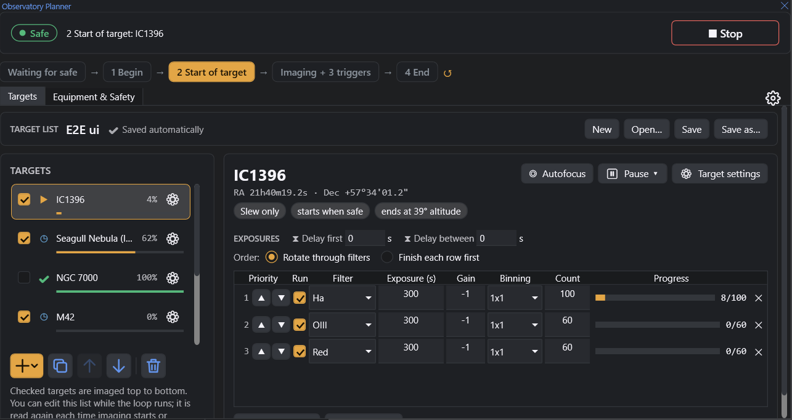

# Observatory Planner for N.I.N.A.

A plugin for [N.I.N.A.](https://nighttime-imaging.eu/) 3.2 that runs an observatory unattended, SGP style. You plan targets in a simple panel; the plugin does the rest every night:

- **With a safety monitor:** waits until it is safe, then powers up, connects, cools, opens the dome and unparks, images your targets in priority order, and shuts everything down when it turns unsafe or the night is done. When it is safe again it resumes where it stopped.
- **Without a safety monitor:** one pass through the targets per Run, starting at astronomical dusk.

The four stages of the night are ordinary Advanced Sequencer instruction sets you can edit with any instruction, including ones from other plugins:

1. **Begin** – when it becomes safe (power on, connect, cool, open dome, unpark)
2. **Start of each target** – slew / center, start guiding
3. **While imaging** – triggers such as dither, autofocus after filter change, meridian flip
4. **End** – when unsafe or finished (stop guiding, park, close, warm, disconnect, power off)



## Features

- Target list with start / end by clock time or altitude (linked: edit one, the other follows), rotation (also from the Framing Assistant), exposure rows (Light, Dark, Bias, Flat) with priority and repeat, progress saved after every frame
- Target Settings with Slew now / Center now (collision warning for low targets, unparks a parked mount), from Framing Assistant or planetarium
- Planning tools: 24-hour altitude chart for tonight; click to set the start, right-click to set the end
- One Pause for the whole run (Pause now / after this step), then Start sequence: continues an interrupted 1 Begin, restarts guiding or runs 2 Start of target again as needed
- Weather: 4 End on unsafe, or close up and wait (park, close the dome, keep the camera cold) with a time limit; a night setting (sun altitude) keeps imaging out of daylight
- Guiding: autofocus after 1 Begin and on filter change (planner trigger), guide star lost handling, guiding error check in pixels
- 4 End always runs when a step stops NINA's sequence; failed 4 End steps are shown; PHD2 and the mount software (e.g. GS Server) close on disconnect
- Countdowns, wait after safe, gap handling between targets, manual autofocus before the next frame, Info (!) page about editing during a run
- Per-profile target lists, workflows and options; the last workflow is reopened at startup and shown in the Advanced Sequencer; optional auto-start when NINA starts

## Requirements

- N.I.N.A. 3.2.0.9001 or later (Windows, .NET 8)
- To build: .NET SDK 8 or later

## Install

Once it is in N.I.N.A.'s plugin list: Plugins › Available › **Observatory Planner** › Install, then restart N.I.N.A.

## Build and install from source

```powershell
dotnet build NINA.ObservatoryPlanner.slnx -c Release
```

Copy `src\NINA.ObservatoryPlanner\bin\Release\net8.0-windows\NINA.ObservatoryPlanner.dll` into
`%LOCALAPPDATA%\NINA\Plugins\3.0.0\Observatory Planner\` and restart NINA. The panel is on the Imaging tab (**Observatory Planner**).

## Tests

Unit tests (engine, scheduling, astronomy, dialogs):

```powershell
dotnet test NINA.ObservatoryPlanner.slnx
```

End-to-end tests in a real NINA with the ASCOM OmniSim simulators and a scripted safety monitor (Python 3). They use a separate test profile and never touch your own:

```powershell
powershell -File tools\e2e\run_e2e.ps1 -Scenario safety   # also: nosafety, ui, negative, timing, single, pause, restart
```

To try the plugin by hand on the simulators: `tools\manual\Start-SimulatorNina.ps1`, and switch the weather with `tools\manual\Set-Safe.ps1 -Safe` / `-Unsafe`.

## Releases

See [CHANGELOG.md](CHANGELOG.md). How a release is built and submitted to N.I.N.A.'s plugin list: [PUBLISHING.md](PUBLISHING.md).

## License

[Mozilla Public License 2.0](LICENSE)
